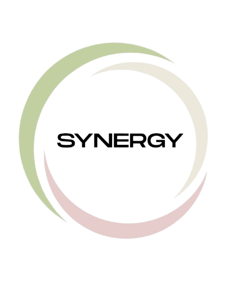
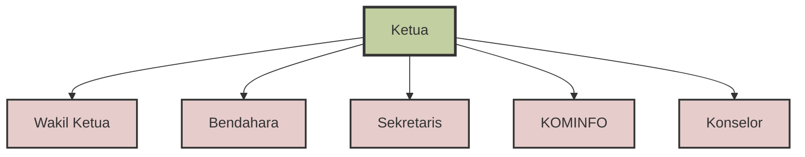

# PIK-R SYNERGY

  <!-- Logo akan ditambahkan di sini -->
  
  
  <h3>🤝 Bersinergi untuk Masa Depan yang Lebih Baik</h3>
  
  
  
  

---

## 📋 Tentang PIK-R SYNERGY

**PIK-R SYNERGY** adalah organisasi remaja yang didirikan pada tahun **2025** dengan fokus pada bidang sosial dan pemberdayaan masyarakat. Kami berkomitmen untuk memberikan dampak positif kepada masyarakat, khususnya remaja di lingkungan RW 11.

### 🎯 Visi
> Menjadi organisasi remaja yang dapat bersinergi dengan kelompok yang ada di lingkungan sekitar.

### 🚀 Misi
1. **Edukasi**: Mengedukasi remaja RW 11 tentang pentingnya perencanaan keluarga dan menghindari perilaku berisiko negatif
2. **Layanan Konseling**: Menyediakan layanan konseling bagi remaja RW 11 yang mengalami masalah reproduksi kesehatan dan masalah emosional  
3. **Pengembangan Keterampilan**: Membantu remaja RW 11 mengembangkan keterampilan hidup sehat, keterampilan sosial dan keterampilan pemecahan masalah

---

## 🎯 Target & Beneficiary

- **Target Utama**: Remaja di lingkungan RW 11
- **Target Sekunder**: Seluruh warga masyarakat
- **Fokus Area**: Kesehatan reproduksi, konseling remaja, dan pengembangan keterampilan hidup

---

## 🏢 Struktur Organisasi
Organisasi PIK-R SYNERGY terdiri dari **12 anggota** yang terbagi dalam berbagai posisi:

| Posisi | Deskripsi |
|--------|-----------|
| **Ketua** | Memimpin dan mengkoordinasi seluruh kegiatan organisasi |
| **Wakil Ketua** | Mendampingi ketua dan menggantikan tugas ketua saat diperlukan |
| **Bendahara** | Mengelola keuangan dan administrasi keuangan organisasi |
| **Sekretaris** | Mengelola administrasi dan dokumentasi organisasi |
| **KOMINFO** | Mengelola komunikasi dan informasi organisasi |
| **Konselor** | Memberikan layanan konseling kepada remaja |

---

## 👥 Tim Kami
Berikut adalah anggota PIK-R SYNERGY yang aktif di GitHub:

Ketua: @username-ketua
KOMINFO: @username-kominfo
Anggota: @username-anggota1
Anggota: @username-anggota2
Anggota: @username-anggota3

💡 Catatan: Jika kamu adalah anggota PIK-R SYNERGY dan ingin ditambahkan di sini, silahkan hubungi KOMINFO untuk update profil GitHub kamu!

---

## 📊 Program & Kegiatan

### 🌟 Program Utama
- **Program Edukasi Remaja**: Memberikan pemahaman tentang perencanaan keluarga dan pencegahan perilaku berisiko
- **Layanan Konseling**: Konseling kesehatan reproduksi dan masalah emosional remaja
- **Pengembangan Keterampilan**: Workshop dan pelatihan keterampilan hidup, sosial, dan pemecahan masalah

### 📅 Status Kegiatan
Sebagai organisasi yang baru didirikan pada tahun 2025, PIK-R SYNERGY sedang dalam tahap perencanaan dan persiapan program-program unggulan untuk memberikan dampak maksimal kepada masyarakat.

---

## 📞 Hubungi Kami

  
| Platform | Link |
|----------|------|
| 📧 **Email** | [pikrsynergy2@gmail.com](mailto:pikrsynergy2@gmail.com) |
| 📱 **Instagram** | [@pikr.synergy](https://www.instagram.com/pikr.synergy/) |
| 💻 **GitHub** | [PIKR-Synergy](https://github.com/PIKR-Synergy) |

---

## 🤝 Bergabung dengan Kami

Tertarik untuk bergabung atau berkolaborasi dengan PIK-R SYNERGY? Kami terbuka untuk:

- **Relawan** yang ingin berkontribusi dalam program sosial
- **Mitra Kolaborasi** untuk program-program pemberdayaan masyarakat
- **Dukungan** dalam bentuk apapun untuk kemajuan organisasi

Hubungi kami melalui kontak yang tersedia untuk informasi lebih lanjut!

---

## 📄 Lisensi & Informasi

- **Tahun Didirikan**: 2025
- **Lokasi**: RW 11
- **Jenis Organisasi**: Organisasi Sosial Remaja
- **Status**: Aktif

---

  <h3>💙 Bersama PIK-R SYNERGY, Mari Bersinergi untuk Perubahan Positif!</h3>
  
  © 2025 PIK-R SYNERGY. All rights reserved.

